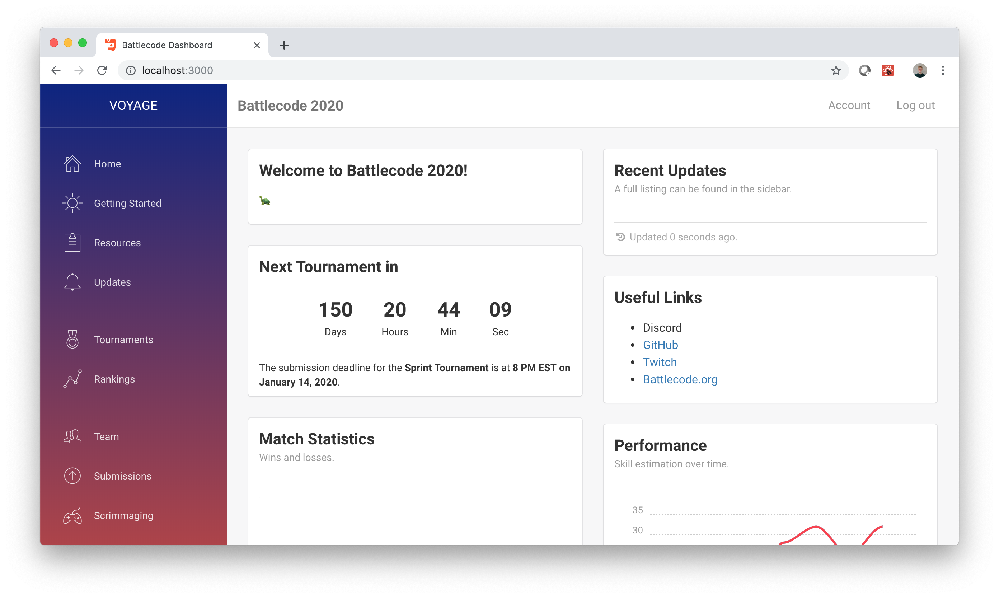

# Battlecode Frontend

Fully static frontend in React, based on `battlecode19/app`, using modified template from http://creative-tim.com. 



## Local Development

You can run `docker-compose up --build` in the root directory of `battlecode20` to run the entire website stack. If for some reason you want to run the frontend outside of Docker, follow the instructions below.

### First-Time Setup

In this directory, run:

```
npm install
```

Also, run `npm install` in `../schema`, `../client/playback` and `../client/visualizer`.

### Running

Make sure that the backend in `../backend` is running at `localhost:8000`.

In this directory, run:

```
npm run start
```

This automatically reloads the page on changes. To run the same thing without automatically opening a browser, run `npm run startx`, and then navigate to http://localhost:3000.

### Notes

When installing a new Node package, always `npm install --save <package>` or `npm install --save-dev <package>`, and commit `package.json` and `package-lock.json`. This should work even if we run it from Docker. If you don't have `npm` installed on your computer, you can `docker exec -it battlecode20_frontend_1 sh` and then run the commands above.

## Deployment

For production, build with `npm run build` for the full thing, and `npm run buildnogame` to build the site without any game specific information. This is handled automatically by calling `./deploy.sh deploy` or `./deploy.sh deploynogame`, respectively. Note that the former should ONLY be called after the release of the game, since it makes the game specs and the visualizer public.

Google Cloud buckets are weird. To configure them to properly handle React single page apps, we need to have every page point to `index.html` — including the error page. To set up the app, then, we need to run `gsutil web set -m index.html -e index.html gs://battlecode20-frontend`. Oddly enough, this does not make the server return a 404 status on unmatched pages, which means that this does indeed work as desired.
